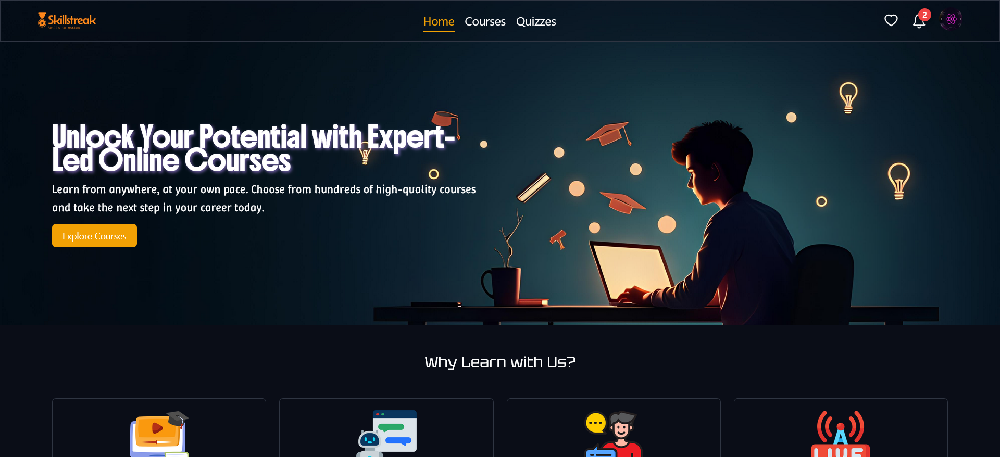
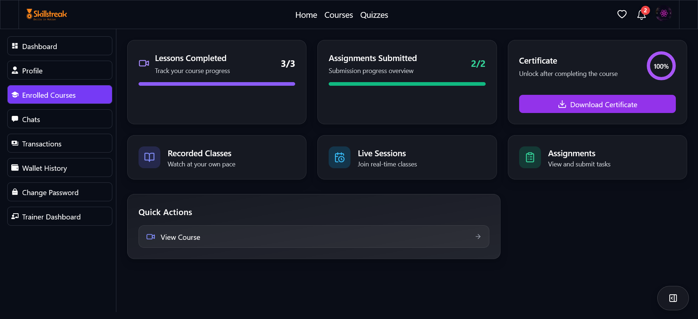
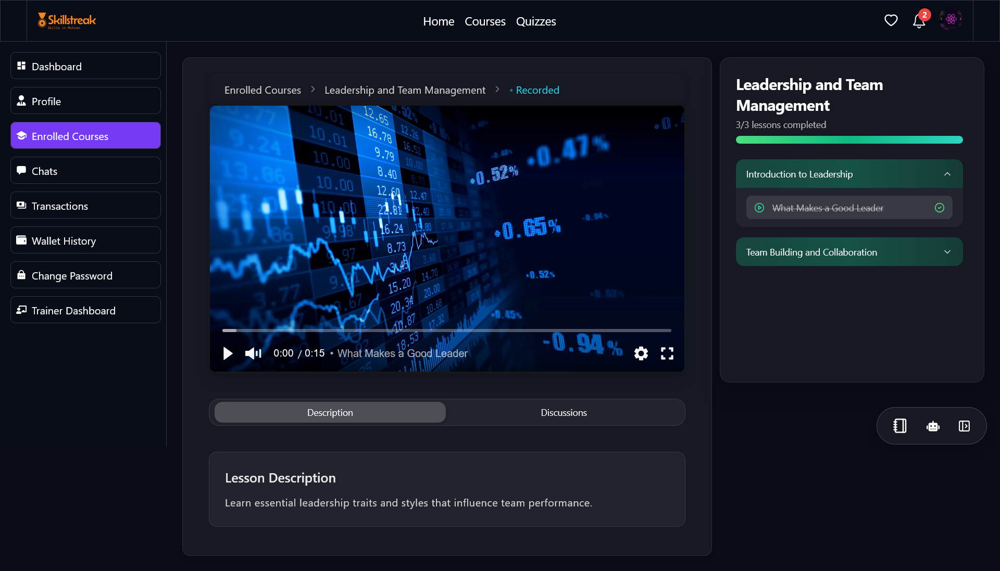
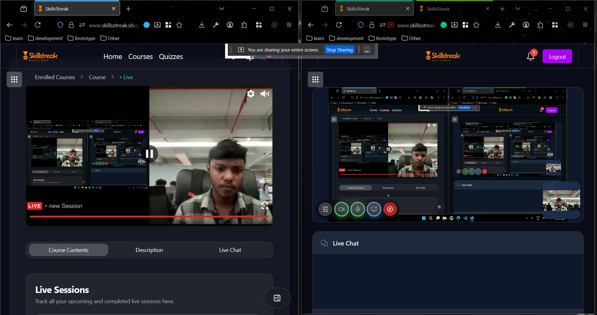
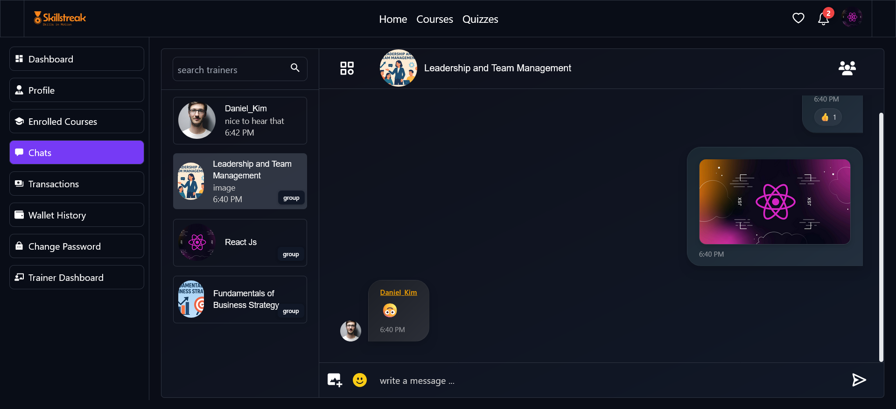
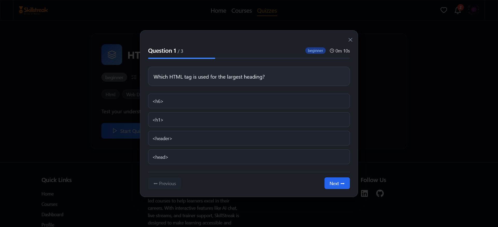

# 🎨 SkillsStreak Frontend — eLearning Platform

This is the **frontend application** for **SkillsStreak**, a full-stack eLearning platform.  
It provides an interactive user interface for authentication, course learning, live sessions, assignments, quizzes, chat, and payments — all powered by a modern **React + TypeScript** stack.

---



## 📚 Features

### 👤 User Authentication & Profile

- Login & signup with JWT + refresh token handling
- Google OAuth login support
- Role-based UI (Student, Trainer, Admin)
- Profile management (update info, upload profile picture via Cloudinary)

---

### 📚 Course Learning

- **Recorded sessions**: Video player with resume playback, PDF preview, and progress tracking
- **Live sessions**: Join interactive classes powered by **LiveKit** (with real-time video, audio, and chat)
- **Post-live replays**: Automatically available for enrolled students
- Course dashboard with progress visualization

  
  


---

### 📝 Assignments

- File upload support (images, PDFs, docs)
- Submission tracking for each course
- Real-time trainer review status (pending / approved / rejected)
- Certificate eligibility check integrated into course flow

---

### 🎓 Certificates

- Auto-generated upon completion of course + approved assignments
- Downloadable certificate (PDF) with verification support

---

### 💬 Chat

- Real-time group chat for enrolled courses
- 1:1 private chat with trainers
- Typing indicators, message read receipts, and scroll persistence
- Built with **Socket.io** and optimized with Redis pub/sub



---

### ❓ Quizzes

- Topic-based quizzes created by trainers/admins
- Timer, multiple-choice support, instant result evaluation
- User quiz history and progress tracking



---

### 💳 Payments & Subscription

- Stripe integration for secure payments
- One-time course purchase or subscription plans
- Checkout flow with validation & webhook-based updates
- Payment history visible in user dashboard

---

### 📊 Admin Features (Frontend Views)

- Manage users (block/unblock)
- Add/manage courses, recorded sessions, and live sessions
- Review & approve assignments
- Create/manage quizzes
- Dashboard analytics view for revenue, course stats, and active users

---

## 🛠 Tech Stack

- **React 18** + **TypeScript**
- **Redux Toolkit** → State management
- **React Query** → Data fetching & caching
- **Tailwind CSS** → UI styling
- **Socket.io Client** → Real-time chat
- **LiveKit React SDK** → Live sessions
- **Zod** → Input validation
- **Stripe JS** → Payments
- **Axios** → API requests
- **React Router** → Routing

---

## 🚀 Deployment

- **Frontend** → Vercel
- **Backend** → AWS (EC2)
- **Database** → MongoDB Atlas
- **Cache** → Redis
- **Storage** → AWS S3
- **CI/CD** → GitHub Actions

---

## 📦 Installation

Clone the repository:

```bash
git clone https://github.com/Ayush-Martin/SkillsStreak-Frontend.git
cd SkillsStreak-Frontend

```

Install dependencies:

```bash
npm install

```

Run in development:

```bash
npm run dev

```

Build for production:

```bash
npm run build

```

## 📧 Contact

👨‍💻 Author: **Ayush Martin**  
📩 Email: **[ayushmartin06@gmail.com](mailto:ayushmartin06@gmail.com)**
